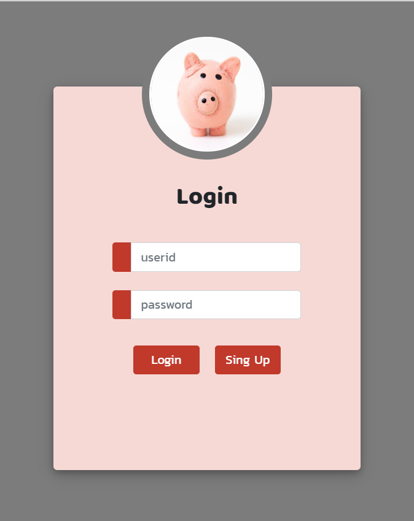

### Etherwallet

------


+ #### **설치**

  ```
  $ git clone https://github.com/jiyoung-lee/ether_wallet.git
  $ npm install
  ```

  

+ #### **실행**

  ```
  $ supervisor ./bin/www
  ```


+ #### **접속**

  ```http://localhost:3000/ ```


+ #### **기능**

  ###### SingUp 화면

  ------

  

  

  > 사용자가 원하는 userid와 password 입력을 통해 회원가입을 한다.
  >
  > userid는 중복된 값을 가질 수 없다.

  

  ###### Login 화면

  ------

  

  

  

  > userid와 password를 입력하여 로그인 한다.
  >
  > 만약 userid가 없다면 SingUp 버튼을 클릭해 회원가입 한다.

  ###### Main 화면

  ------

  

  

  

  > [Send]버튼을 통해 이더 전송을 한다.
  >
  > [getEther]버튼을 통해 이더를 얻을 수 있다.
  >
  > [account]버튼을 통해 개인키를 볼 수 있다.
  >
  > 전송된 이더 내역을 조회할 수 있다.

  

  ###### Send 화면

------

  

  > 받는 사람의 계정이 올바르지 않거나 user가 소유한 이더값이 
  >
  > 보낼 수량 보다 적으면 err가 발생한다.

  

  ###### Privatekey 화면

------

  

  

  

  

  > userid와 password을 통해 개인키 확인 가능하다.


------

